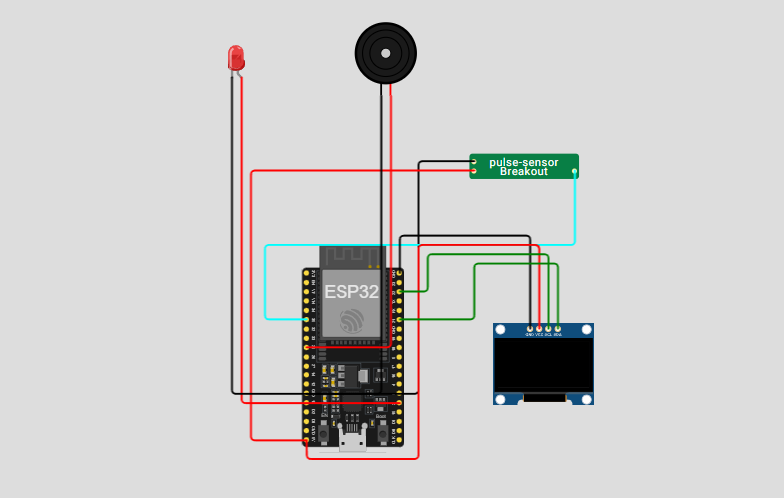

# 🫀 Medidor de Batimentos – Pedro  

Projeto desenvolvido no **Wokwi** utilizando **ESP32**, **sensor de pulso**, **display OLED**, **buzzer** e **LED indicador**, com envio dos dados via **MQTT**.



--- 

## 📌 Sobre o Projeto
Este projeto simula um medidor de batimentos cardíacos utilizando um ESP32, exibindo as informações em um display OLED e enviando os dados para um broker MQTT. O sistema classifica o estado cardíaco e aciona alertas sonoros e visuais caso o BPM esteja fora da faixa segura.

O código foi desenvolvido para execução no simulador **Wokwi**, mas é totalmente compatível com hardware real.

---

## 🛠️ Funcionalidades

- 🖥️ Exibição em **OLED SSD1306**
- ❤️ Leitura simulada de batimentos cardíacos (BPM)
- 🚨 Alarme visual com LED
- 🔊 Alarme sonoro com buzzer
- 📡 Envio de dados via MQTT:
  - `cardio/batimento` → valor do BPM  
  - `cardio/estado` → *abaixo*, *acima* ou *estavel*
- 🌐 Conexão automática ao Wi-Fi
- 🔁 Reconexão automática ao servidor MQTT

---

## 📷 Diagrama Wokwi

O projeto inclui o arquivo `diagram.json` para simulação completa no Wokwi.

### Componentes utilizados:

- ESP32 Devkit V1  
- Sensor de pulso (Pulse Sensor)  
- Display OLED SSD1306 (I2C – 0x3C)  
- LED vermelho (alarme)  
- Buzzer  

---

## 🔌 Ligações (Resumo)

| Componente | ESP32 |
|-----------|-------|
| Sensor OUT | GPIO 35 |
| OLED SDA | GPIO 21 |
| OLED SCL | GPIO 22 |
| LED | GPIO 2 |
| Buzzer | GPIO 25 |
| VCC (OLED e sensor) | 5V |
| GND | GND |

---

## 📡 Configuração Wi-Fi e MQTT

Wi-Fi padrão do Wokwi:
```cpp
const char* ssidWiFi = "Wokwi-GUEST";
const char* senhaWiFi = "";
```

---

## 🛰️ Broker MQTT Público

```cpp
const char* servidorMQTT = "test.mosquitto.org";
```

---

## 🧠 Lógica do Sistema

| BPM     | Estado  | Ação                 |
|---------|---------|----------------------|
| < 50    | Abaixo  | LED + Alarme sonoro |
| 50–120  | Estável | Exibição normal      |
| > 120   | Acima   | LED + Alarme sonoro |

---

## 📄 Arquivos do Projeto

- **sketch.ino** → código principal  
- **diagram.json** → circuito Wokwi  
- *(Opcional)* Imagens, vídeos e anotações  

---

## ▶️ Executando no Wokwi

1. Acesse: https://wokwi.com  
2. Importe os arquivos **sketch.ino** e **diagram.json**  
3. Execute o simulador  
4. Veja os dados no display OLED e no Serial Monitor  
5. Para monitorar MQTT, utilize o **MQTT Explorer** ou a **CLI do mosquitto**

---

## 📦 Bibliotecas Utilizadas

- `Wire.h`  
- `Adafruit_GFX`  
- `Adafruit_SSD1306`  
- `WiFi.h`  
- `PubSubClient.h`

---

## 📘 Exemplo de Saída Serial

```
BPM lido: 78 | Estado: estavel
BPM lido: 130 | Estado: acima
BPM lido: 45 | Estado: abaixo
```

---

## 🚀 Possíveis Melhorias

- Enviar histórico de BPM  
- Criar dashboard em Node-RED  
- Adicionar sensor real MAX30102  
- Implementar OTA (over-the-air update)

---

## 📄 Licença

Este projeto é de código aberto. Sinta-se à vontade para modificar e melhorar!
